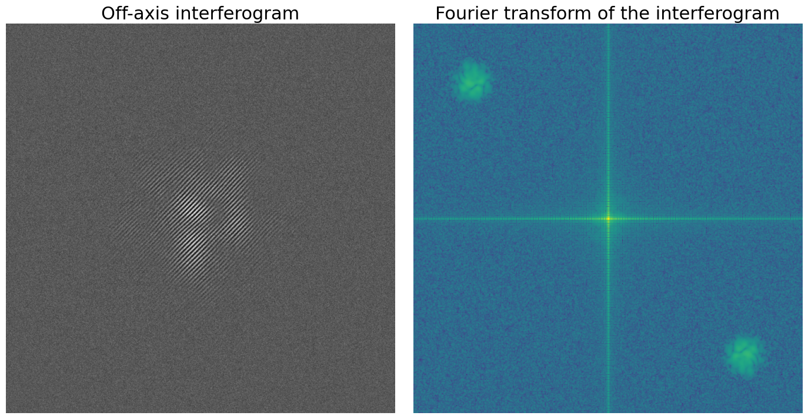
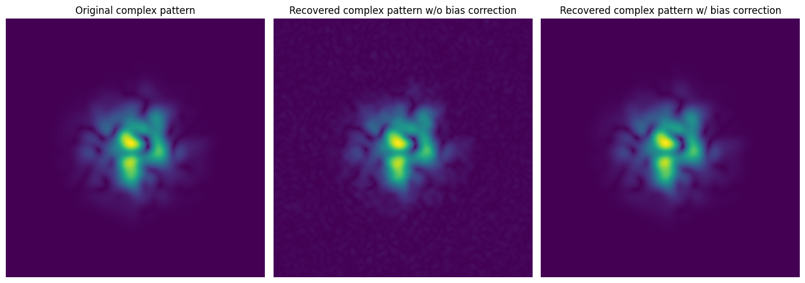
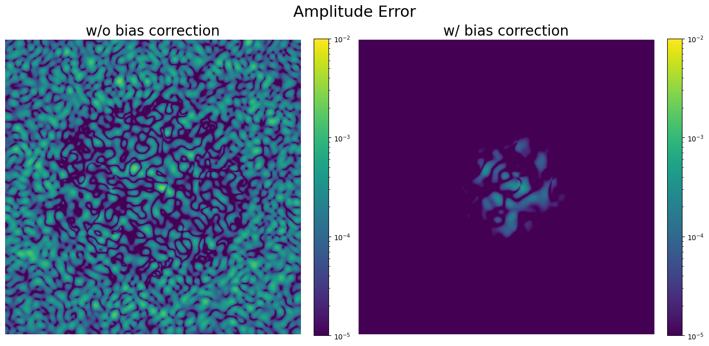
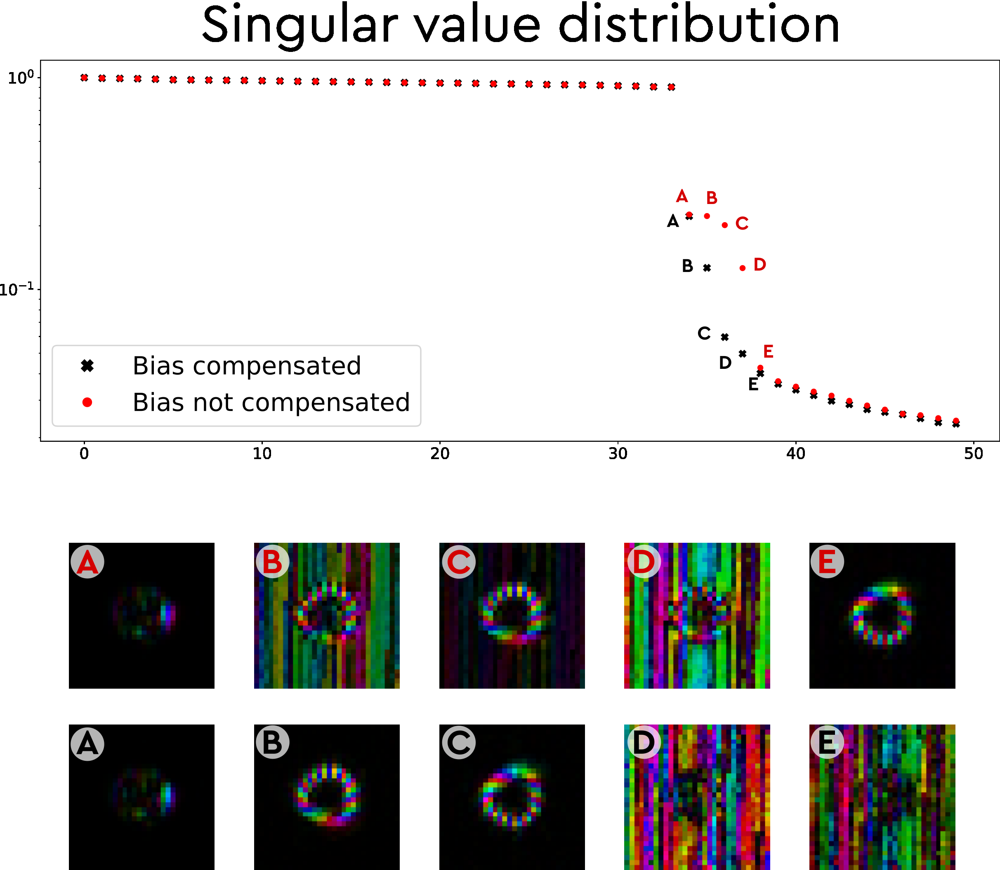

# How to Correct for Bias in Off-Axis Holography for Transmission Matrix Measurements

I presented in a previous [tutorial](https://www.wavefrontshaping.net/post/id/12) how to reconstruct a complex field using a camera and a plane wave reference tilted with respect to the optical axis, known as *off-axis holography*. This works perfectly with an ideal plane wave as a reference. Of course, real life is not perfect, and the reference usually presents imperfections. While low spatial fluctuations can be compensated for afterward, high spatial frequency noise has the effect of adding a small bias to the estimation of the field. Such bias is typically small, but in transmission matrix measurements—since it is static and added to all measurements—it can affect the singular value distribution and perturb or hide transmission channels that would otherwise be visible.

## Off-Axis Holography Process (Reminder)

Let \(E_s(\vec{r})\) be the wavefront we want to characterize and \(E_\text{ref}(\vec{r}) e^{i\vec{\nu}\cdot\vec{r}}\) the field used as reference, with \(\vec{\nu}\) representing the spatial frequency of the interference fringes in the plane of the camera (\(\vec{\nu}\cdot\vec{r} = \nu_x x + \nu_y y\)).  
In the ideal case, \(E_\text{ref}(\vec{r}) = E_0\) is constant (i.e., representing an ideal plane wave). Thus, for a well-chosen angle between the reference and the signal, represented by \(\vec{\nu}\), the interference pattern can be decomposed into terms well separated in the Fourier plane:

$$ I = \underbrace{\left|E_0\right|^2 + \left|E_s(\vec{r})\right|^2}_{\textrm{order 0}} + \underbrace{E_0 E_s^*(\vec{r})e^{ik \vec{\nu}\cdot\vec{r}}}_{\textrm{order +1}} + \underbrace{E_0^* E_s(\vec{r})e^{-ik \vec{\nu}\cdot\vec{r}}}_{\textrm{order -1}} $$

The process, explained in more detail in this [tutorial](https://www.wavefrontshaping.net/post/id/12), can be divided into 4 steps:

1. Fourier transform of the interferogram, this operation is written as \(F\),
2. Filtering to keep the window of spatial frequencies centered around the desired order, written as \(Filter\),
3. Shift the signal around the DC component (zero spatial frequency), noted as \(Shift\),
4. Inverse Fourier transform, noted as \(F^{-1}\).

The goal of \(Filter\) and \(Shift\)  is to keep only the -1 order and center it around 0 frequency, so that

$$ 
OA\left[I\right] = F^{-1}\left[Shift\left[Filter\left[F\left[I\right]\right]\right]\right] = E_0^* E_s(\vec{r}) \propto E_s(\vec{r})
$$

So the operator \(OA\), representing the off-axis operation, is the composition of those four operations and reads:

$$ 
OA = F^{-1} \circ Shift \circ Filter \circ F
$$

Note that we assume everything is OK, meaning that:
- the fringes of \(I\) are well sampled by the pixels of the camera, so that we can disregard the effect of sampling and just consider the continuous variable \(\vec{r}\),
- \(\|\vec{\nu}\|\) is higher than the maximal spatial frequency of the signal, so that orders \(\pm 1\) do not overlap with the 0-th order.

## Effect of Imperfect Reference

In a real experiment, \(E_\text{ref}(\vec{r})\) is not constant but presents fluctuations that we will consider random but static. We can divide these into two terms: high- and low-spatial frequency components, which we define more precisely later:

$$E_\text{ref}(\vec{r}) = E_0 + E_{LF}(\vec{r}) + E_{HF}(\vec{r})$$

We assume here that the phase of the reference (excluding the off-axis term) is still constant, so all these terms are real.

We should now consider the intensity of the interference:

$$ 
I = \underbrace{\left|E_\text{ref}(\vec{r})\right|^2 + \left|E_s(\vec{r})\right|^2}_{\textrm{order 0}} + \underbrace{E_\text{ref}(\vec{r}) E_s^*(\vec{r})e^{ik \vec{\nu}\cdot\vec{r}}}_{\textrm{order +1}} + \underbrace{E^*_\text{ref}(\vec{r}) E_s(\vec{r})e^{-ik \vec{\nu}\cdot\vec{r}}}_{\textrm{order -1}} $$

### Effect of Low-Spatial Frequency Fluctuations

In the presence of only low spatial frequency fluctuations, we have:

$$OA\left[I\right] = \left[E_0 + E_{LF}(\vec{r})\right] E_s(\vec{r})$$

In essence, this means that low spatial frequencies of the reference—i.e., frequency components not filtered out by the \(Filter\) operation—modulate the measured signal.  
This term can be easily compensated for by measuring the intensity of the reference, filtering it to retain only low spatial frequencies (corresponding to the mask in the Fourier plane used in the off-axis procedure), and dividing the result of the off-axis operation by this term.

Thus, the signal field is approximated by \(\hat{E}_s(\vec{r})\), computed using:

$$
\hat{E}_s(\vec{r}) = OA\left[I\right] / B(\vec{r})
$$

with

$$
B(\vec{r}) = F^{-1} \circ Filter \circ F\left[I^\text{ref}(\vec{r})\right]
$$

Note that we apply here on the reference intensity \(I^\text{ref}(\vec{r})\) the same operation as for the off-axis \(OA\), but **without** the shift operation, as we are interested in the low spatial frequencies of the reference.

### Effect of High-Spatial Frequency Fluctuations

If we now consider only high-spatial frequency fluctuations, the situation is slightly different. In the cross term identified as the -1 order, those high-frequency terms are filtered out by \(Filter\). However, the term corresponding to the intensity of the reference, \(\left|E_\text{ref}\right|^2\), may overlap with the \(\pm1\) orders:

$$
OA\left[I\right] = E_0(\vec{r}) E_s(\vec{r}) + I^\text{ref}_{HF}(\vec{r}) 
$$

So we add a bias \(I^\text{ref}_{HF}(\vec{r})\) to all estimations of the field, corresponding to high spatial frequencies in the reference intensity.  More precisely, it corresponds to spatial frequencies centered around \(\vec{\nu}\), with a bandwidth determined by the \(Filter\) operation. However, these details are not necessary to recover and remove this term.

Indeed, this term is the **only** one that appears if we apply the full off-axis operation to the intensity of the reference:

$$
OA\left[I^\text{ref}\right] = I^\text{ref}_{HF}(\vec{r})
$$

Thus, in practice, it is quite simple to obtain: block the signal beam to record only the reference intensity, then apply the off-axis operation to it. The result should then be subtracted from all subsequent measurements with the signal.

A better estimation \(\hat{E}_s(\vec{r})\) of the signal is then:

$$
\hat{E}_s(\vec{r}) = OA\left[I\right] - OA\left[I^\text{ref}\right]
$$

Note that the high-frequency component may be quite small, and we are only interested in the **static** ones (those that do not fluctuate in time). It is therefore a good idea to average the reference intensity over multiple measurements for a reliable estimation of the bias.

**TL;DR**  
To remove the bias due to high spatial-frequency components of the reference, first apply the off-axis operation with the **reference only**, preferably averaged. Subtract the result from all subsequent field estimations.

### Global Solution

In addition to measuring the interference pattern \(I\), only one additional measurement is needed: the intensity of the reference \(I^\text{ref}\):

$$
\hat{E}_s(\vec{r}) 
    = \left(OA\left[I\right] - OA\left[I^\text{ref}\right]\right) / B(\vec{r})
$$

with

$$
B(\vec{r}) = F^{-1} \circ Filter \circ F\left[I^\text{ref}(\vec{r})\right]
$$

- **Note 1.** About the order of operations: we need to first remove the bias **before** compensating for low spatial frequency variations of the reference.  
- **Note 2.** When measuring multiple complex signals, as long as the reference does not change, \(I^\text{ref}\) only needs to be measured once.  
- **Note 3.** The relative effect of the bias depends on the global intensity of the reference. The raw reconstructed signal \(E_\text{ref} E_s(\vec{r})\) is proportional to the square root of the reference intensity, while the bias is proportional to the intensity. If there is enough power to ensure a good signal-to-noise ratio in the interferogram, increasing the reference intensity may not be beneficial.

## Effect on One Field Measurement (Simulations)

I generate a reference and a speckle pattern for the signal \(E_s\) with a Gaussian envelope. To illustrate this effect, I use a noisy tilted plane wave reference with high-frequency fluctuations at 10% of the average reference amplitude. The average reference amplitude is about twice the maximal signal amplitude.

For off-axis reconstruction, I follow the basic [off-axis procedure](https://www.wavefrontshaping.net/post/id/12) using ZoomFFT (see the [ZoomFFT tutorial](https://www.wavefrontshaping.net/post/id/90)).

See the [notebook](simulation_bias.ipynb) for more details.

We first show the interferogram (left) and its Fourier transform (right). The \(\pm1\) orders are well separated from the 0-th order, but high-frequency components of the reference add contributions throughout the spectrum.

We then compare the result to the original field. We show here only the amplitude. While the difference is not dramatic, a noisy background appears when not compensating for the bias, which disappears when using the proposed approach.

To better assess the difference, we plot the quadratic error on the amplitude of the field in both cases. In many practical experimental scenarios, this might not significantly affect the quality of the reconstructed field, as other noise sources are present. However, we show next that it **can** have a dramatic effect on transmission matrix measurements.

## Effect on the Transmission Matrix (Experiment)

The goal here is to illustrate the **qualitative** negative impact the bias can have on transmission matrix measurements. As stated before, this bias is typically small. However, in transmission matrix measurements, because the bias is constant, it adds energy to the matrix that is not physical. This is especially detrimental when using a large input basis (i.e., many pixels on the modulator) and when few high-transmission channels exist. The cumulative effect of the bias across all measurements adds singular values that do not correspond to any physical channel.

In the experiment, we measure the transmission matrix of a 1-meter multimode fiber with 34 propagating modes, using an input basis of 30×30 focal spots. To collect all relevant information, the scanned area is larger than the core, meaning some focal spots have low transmission—yet the bias remains (since it is constant).

We reconstruct the transmission matrix from the same set of interferograms, with and without bias compensation. We present here the resulting singular value distributions, as well as the input singular vector profiles for selected singular values:

We expect a plateau of singular values close to 1 (corresponding to the propagating modes), a continuum of low singular values (corresponding to noise), and potentially some modes near cut-off with intermediate transmission due to the short fiber length.

We observe that, without compensating for the bias, the *gap* between propagating modes and noise includes singular vectors with transmission over the whole scanned area. This is unphysical, as transmission should be limited to the fiber core. When compensating for the bias, these vectors are pushed back to lower singular values, allowing us to observe and **quantify** the transmission of near-cutoff modes more accurately.
